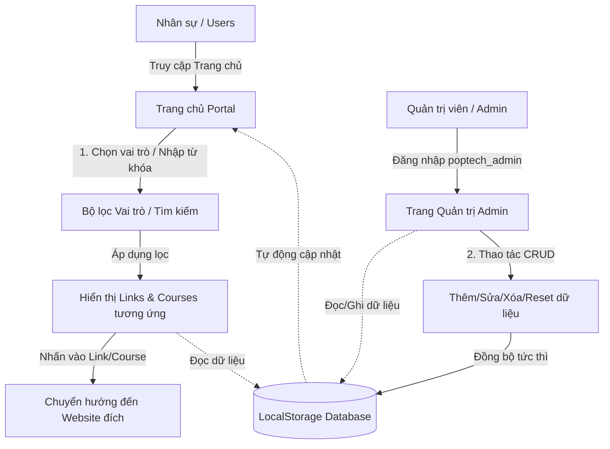

# POPTech Central Support Portal 🚀
> Cổng thông tin tập trung, an toàn và tối ưu hóa trải nghiệm truy cập dự án, công cụ nội bộ và học viện đào tạo dành cho nhân sự POPTech.

---

## 📌 Tổng quan Dự án
**POPTech Central Support Portal** là nền tảng Hub điều hướng trung tâm (Project Shortcuts Hub) giúp nhân viên trong doanh nghiệp dễ dàng truy cập nhanh vào các website dự án, kênh truyền thông, báo cáo dữ liệu, và tham gia các chương trình đào tạo nội bộ. 

Dự án được thiết kế theo phong cách giao diện cao cấp của **Sophos & Markee Workspace** với cơ chế bảo mật khóa liên kết, phân quyền theo vai trò, hỗ trợ giao diện Sáng/Tối (Light/Dark Mode) và đa ngôn ngữ (Tiếng Việt & Tiếng Anh).

---

## 🌟 Tính năng Nổi bật

### 1. Bộ chọn Vai trò (Role Switcher)
* Tích hợp bộ chọn vai trò động tại thanh Sub-header.
* Hỗ trợ các vai trò cụ thể: `Sales`, `Marketing`, `Developer`, `Leader / PM`, `Nhân viên mới` và `Tất cả`.
* Khi thay đổi vai trò, hệ thống tự động lọc và hiển thị chính xác các liên kết (Portal Cards) và khóa học học viện (Courses) được cấp quyền tương ứng.

### 2. Bảng Chỉ số Thông minh (Metrics Grid)
* Hiển thị 3 chỉ số thống kê động trên đầu trang chủ dựa theo vai trò đang chọn:
  1. **Trang web được cấp:** Tổng số phím tắt liên kết khả dụng.
  2. **Tiến độ Onboarding:** Tự động hiển thị tiến độ 68% cho Nhân viên mới và 100% cho các nhân sự chính thức khác.
  3. **Khóa học có sẵn:** Số lượng giáo trình học tập dành riêng cho vai trò đó.

### 3. Học viện POPTech (POPTech Academy)
* Danh sách khóa học được thiết kế dạng Card 3 cột với màu sắc Gradient nổi bật (`c1` đến `c6`).
* Tích hợp thanh tiến độ học tập (Progress Bar) màu hồng chuyên nghiệp cùng nút phát bài học (Play button).
* Hiệu ứng **Micro-animations**: Card nhô lên đổ bóng sâu và nút Play tự phóng to, xoay nhẹ đổi màu hồng khi người dùng di chuột (`hover`).

### 4. Danh bạ Liên kết trang web (Shortcuts Directory)
* Hỗ trợ công cụ tìm kiếm thời gian thực (Search bar) và các tab lọc theo phân loại: *Vận hành (Ops)*, *Dữ liệu (Data)*, *Truyền thông (Social)*, *Công cộng (Public)*.
* Trạng thái bảo mật: Khóa/Mở khóa biểu tượng khóa tinh tế khi liên kết bị quản trị viên khóa lại.
* Hỗ trợ tải lên ảnh icon từ máy khách (Base64) hoặc chèn URL icon tùy biến.

### 5. Trang Quản trị (Admin Console)
* Đăng nhập bảo mật qua tài khoản quản trị viên mặc định:
  * **Tên tài khoản:** `poptech_admin`
  * **Mật khẩu:** `poptech@support2026`
* Cung cấp giao diện bảng quản lý riêng biệt với 2 tab: **Liên kết trang web** và **Khóa học Học viện**.
* Hỗ trợ đầy đủ các thao tác **CRUD** (Thêm mới, Chỉnh sửa, Xóa) và nút *Khôi phục dữ liệu gốc* ban đầu.

---

## 🔄 Luồng Hoạt Động (Data & Operation Workflow)



### Chi tiết luồng xử lý:
1. **Phía Người dùng (Users):**
   * Người dùng truy cập `Home (/)`, mặc định hệ thống hiển thị tất cả các liên kết và khóa học.
   * Người dùng chọn một vai trò (ví dụ: `Sales`) hoặc tìm kiếm từ khóa, React State sẽ kích hoạt bộ lọc và render lại danh sách các Portal Cards & Courses tương ứng lấy từ `LocalStorage`.
   * Giao diện Sáng/Tối và ngôn ngữ (VI/EN) được quản lý qua React Context, lưu lại trạng thái trong Cookie/LocalStorage để duy trì phiên làm việc.
2. **Phía Quản trị (Admin):**
   * Quản trị viên truy cập `/admin`, điền tài khoản hệ thống xác thực.
   * Session login được lưu vào `sessionStorage` (`sz_admin_auth`).
   * Khi Admin tạo mới/chỉnh sửa một liên kết hoặc khóa học (bao gồm upload logo dạng Base64 < 500KB hoặc liên kết URL ảnh), hệ thống sẽ cập nhật mảng state và đồng bộ trực tiếp vào các key tương ứng trong `LocalStorage`:
     * `sz_portal_links` (Dữ liệu liên kết)
     * `sz_portal_courses` (Dữ liệu khóa học Học viện)
   * Trang chủ (`Home`) khi reload hoặc đổi vai trò sẽ lập tức cập nhật dữ liệu mới nhất từ các key này.

---

## 💻 Công nghệ Sử dụng
* **Framework:** Next.js 15+ (App Router)
* **Ngôn ngữ:** TypeScript
* **Quản lý trạng thái:** React Hooks (`useState`, `useEffect`, `useContext`)
* **Lưu trữ dữ liệu cục bộ:** Web LocalStorage & SessionStorage
* **Styling (CSS):** Vanilla CSS cao cấp, Responsive tương thích Mobile, Tablet & PC

---

## 🛠️ Hướng dẫn Cài đặt & Chạy dưới Local

### 1. Yêu cầu hệ thống
* Đã cài đặt **Node.js** (Phiên bản 18 trở lên).
* Đã cài đặt **npm** hoặc **yarn**.

### 2. Các bước cài đặt
Di chuyển vào thư mục dự án và thực hiện các lệnh sau:

```bash
# 1. Cài đặt các gói thư viện phụ thuộc
npm install

# 2. Chạy ứng dụng dưới chế độ Phát triển (Development Mode)
npm run dev

# 3. Biên dịch dự án tối ưu hóa Production
npm run build

# 4. Chạy dự án đã biên dịch
npm run start
```

Sau khi chạy lệnh `npm run dev`, mở trình duyệt truy cập: [http://localhost:3001](http://localhost:3001) để xem kết quả.
